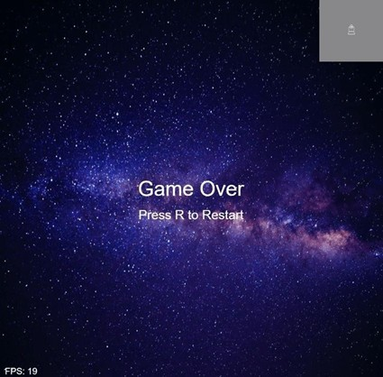
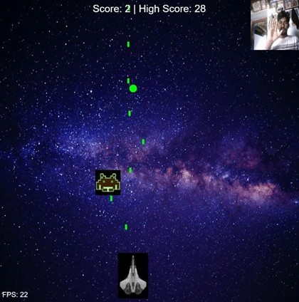

# 🕹️ Astro Fighter – Hand-Controlled Obstacle Avoidance Game

Astro Fighter is a browser-based shooting game where you control a spaceship using **your hand movements via webcam**. The paddle (ship) follows your index finger, and bullets are automatically fired to destroy falling obstacles.

Built using:
- 🖌️ [p5.js](https://p5js.org/) for graphics and interaction
- 🤖 [ml5.js](https://ml5js.org/) for hand tracking (Handpose)
- 📷 Webcam for gesture-based control

---

## 🚀 How to Play

1. **Allow webcam access** when prompted.
2. Move your **index finger left or right** in front of the webcam to move the spaceship.
3. The spaceship **shoots bullets automatically** when your hand is detected.
4. **Avoid or shoot the falling obstacles** to increase your score.
5. The game ends if an obstacle hits your paddle.
6. Press `R` to **restart the game**.

---

## 🛠️ Features

- Real-time **hand tracking** using the Handpose model
- **Gesture-controlled paddle** movement
- **Dynamic difficulty** (obstacles speed up as score increases)
- Tracks **score and high score**
- Clean UI with live FPS and webcam preview

---

## Images

